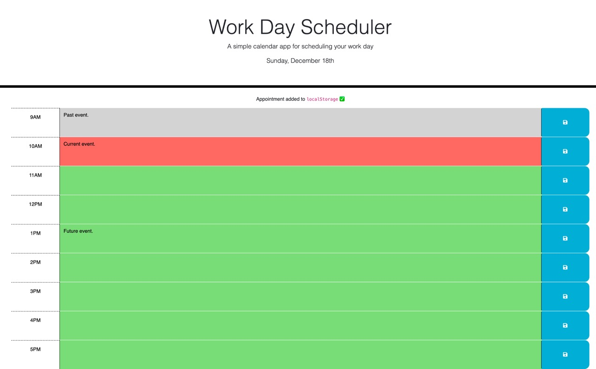

# Work Day Scheduler

## Description 

Keeping track of a busy schedule is often difficult in the modern workplace, with multiple tasks competing for employees' attention.

This application is a simple solution to managing the hours of the work day. Employees can add tasks to each hour and are given visual feedback with colour coding as to which task is current, pending, or (hopefully!!) complete.

[Deployed GitHub Page]()

## Usage

The user is shown the current date in the header.

When the user writes anything in a particular hour's text box they can save the text whereby it will be visible on the page upon refresh. The user is alerted that their text is added to ``localStorage``.

The user is to prioritise tasks based on the colour code system utilised by the application. 

## Credits

Original codebase by [edX](https://techbootcamp.sydney.edu.au/coding/).

JavaScript completed by Morgan Qasabian.

## Features

- In addition to a CSS file, Bootstrap is used as a framework for styling
- JQuery and dayjs libraries are used in the JavaScript file
- Dayjs is used to display the current date in the header 
- Each hour is colour coded indicating whether the hour/task is past (grey), present (red), or future (present). This is done by comparing each hour with that day's current hour using dayjs and a for loop
- A click event on any hour's save button will store the user inputted text in ``localStorage``
- A for loop iterating over an array containing the id selectors for every hour block gets the saved text from ``localStorage`` and displays the text upon refresh